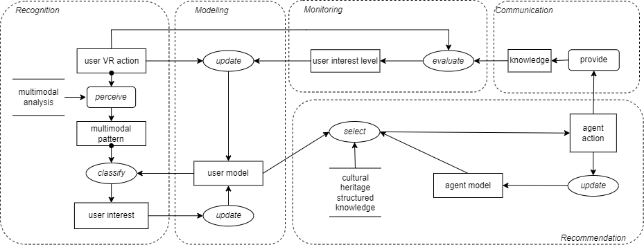

# Scenario 1 Task Decomposition

## Title 
Multimodal Interactions.

## Description 
The agent captures Sarah's gaze, facial expressions, and speech inputs, employing multimodal analysis and reasoning to understand her interests. Based on the interpreted multimodal inputs, the agent dynamically tailors its interaction (e.g. highlighting specific objects in the painting to guide visual attention or encourage hand grabbing, offering additional cultural background, recommending related paintings), thus providing Sarah with personalized information according to her interests.

## Visual Task Decomposition

