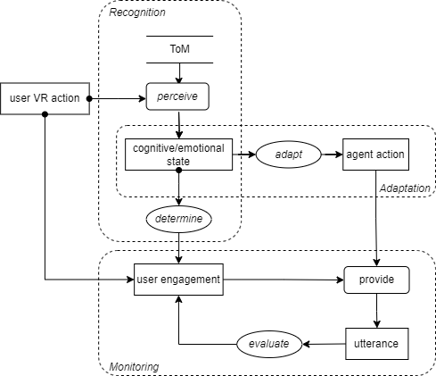

# Scenario 2 Task Decomposition

## Title 
Real-time Understanding of User States.

## Description 
The agent employs Theory of Mind to assess Sarah's beliefs, intentions, and emotions as she interacts with the agent within the virtual environment. The agent dynamically adjusts its responses to align with Sarah's beliefs or intentions, provides emotional support to address her feelings, or changes its own beliefs, intentions, and emotions to improve future interactions.

## Visual Task Decomposition

