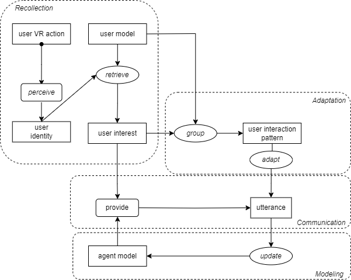

# Scenario 3 Task Decomposition

## Title 
Memory Integration for Personalization.

## Description 
The agent, equipped with memory capabilities, observes Sarah's actions, recalling her preferences (e.g. a favorite painter from a past session), and integrates them with information from previous users to enhance the exhibition experience. The agent adapts its explanations based on known user patterns and preferences, giving more emphasis to artists and styles resonating with users sharing similar tastes. The agent actively learns from its past actions, storing this knowledge in its memory, to inform and improve future interactions with users.

## Visual Task Decomposition

