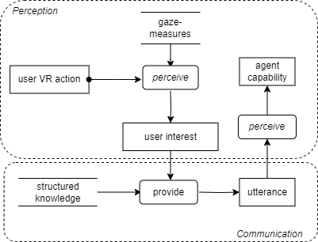

# Scenario 4 Task Decomposition

## Title 
Perception Building.

## Description 
An ongoing communication between Sarah and the agent takes place. The agent employs analytics, e.g. gaze-based measures, to learn information about Sarah's interests or knowledge level. Simultaneously, Sarah gains insights into the agent's capabilities and limitations, understanding the type of information it can and cannot provide, shaping her perception of the agent's abilities.

## Visual Task Decomposition

