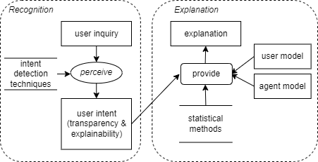

# Scenario 5 Task Decomposition

## Title 
Transparency and Explainability.

## Description 
Intrigued by the agent's highlighted paintings, Sarah asks for the reasons behind these choices. In response, the agent provides a transparent explanation, detailing the information it utilized (e.g. Sarah's interest and preferences, her past interactions, and insights gathered from other users' engagements) and the overall narrative flow of the exhibition. This transparent communication enhances Sarah's trust in the agent's guidance, enriching her overall experience.

## Visual Task Decomposition

