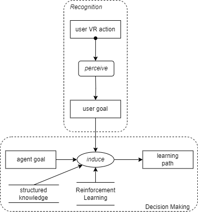

# Scenario 6 Task Decomposition

## Title 
Collaborative Pursuit of Goals.

## Description 
Sarah and the agent engage in a collaborative exploration. The agent's goal is to foster understanding of the exhibition's theme by showcasing curated paintings, while Sarah focuses on learning different art styles. The agent adapts its guidance to accommodate both educational goal and artistic appreciation. Their collaborative efforts result in a comprehensive and immersive exploration, satisfying both individual and shared objectives.

## Visual Task Decomposition

